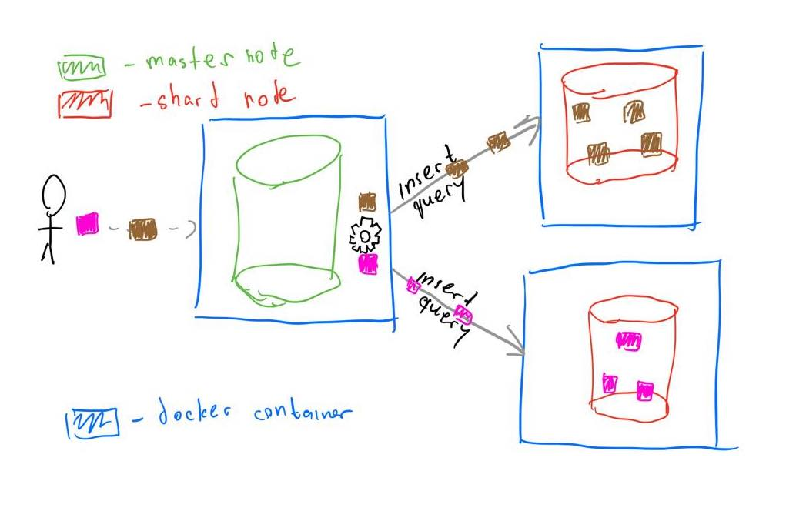

# Database Replication
This implementation uses PostgreSQL database and several docker containers to set up a very simple sharded cluster.

## Context
In this workshop project we have a very simple database structure, We want to store students in the database, but we also want, due to high load, to 
balance the load in the different shards on the different nodes, so that data load is distributed ( We are talking about horizontal sharding ).

## Architecture

# Goal
Goal of this mini project is to implement simple sharding mechanism for Postgresql database tables.
Idea of the script/application is to move 1 "big" database into 2 distributed smaller ones in their isolated environments and let them talk.

# Setup
- Run `docker-compose up -d`
- Update auth. conf file for shard database, for it to receive master traffic. pg_hba.conf file in shard database using next command: `docker exec -it shard bash && echo "host all all 0.0.0.0/0 trust" >> /var/lib/postgresql/data/pg_hba.conf`
- Exit container shell: `exit`
- Restart shard docker container: `docker restart postgres_shard`
