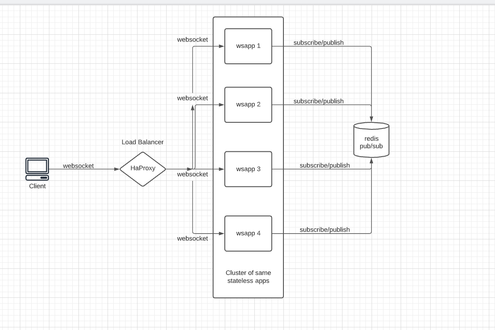

# Clustered node js app using redis for synchronization

# Building docker image

    docker build -t wsapp .

# Running docker containers to initialize system

This command will run 4 nodejs "wsapp" containers, haproxy load balancer and a redis container

    docker-compose up --build

# Using system / client side

For testing client side of the system i used wscat utility npm package which uses web sockets under the hood.

# System diagram

